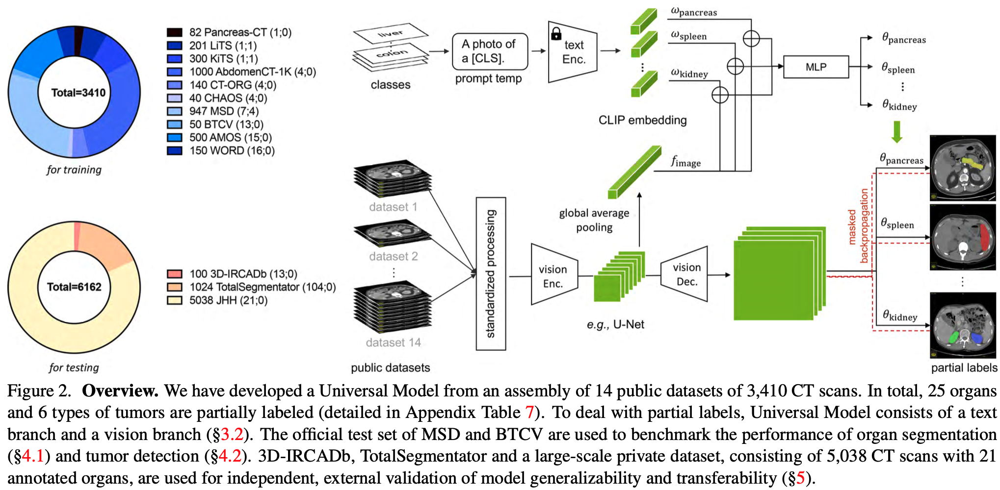
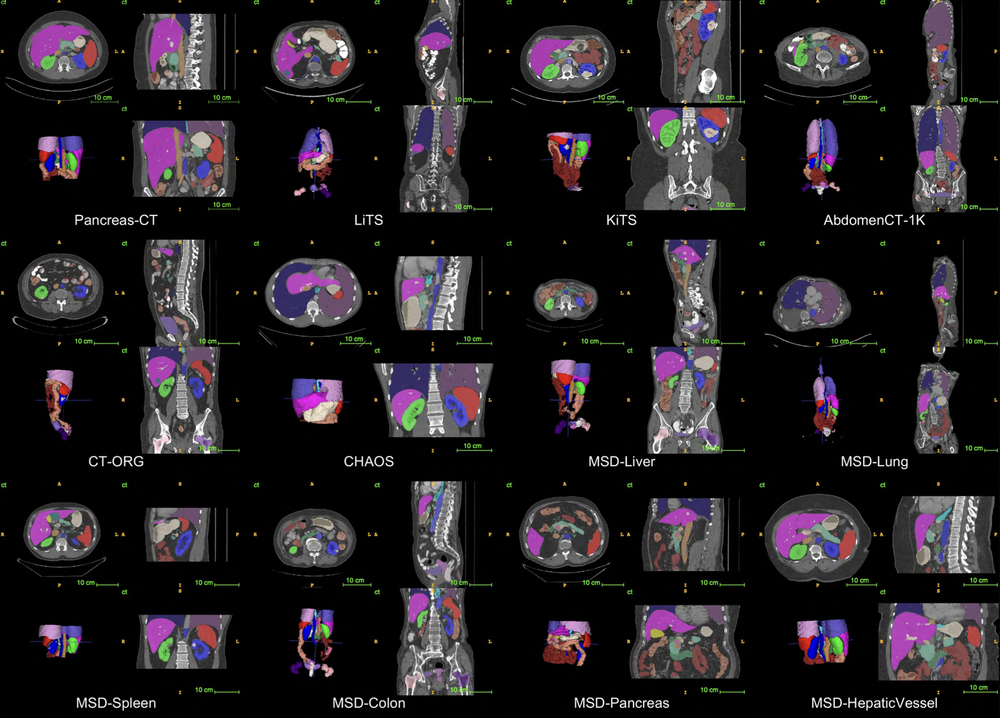
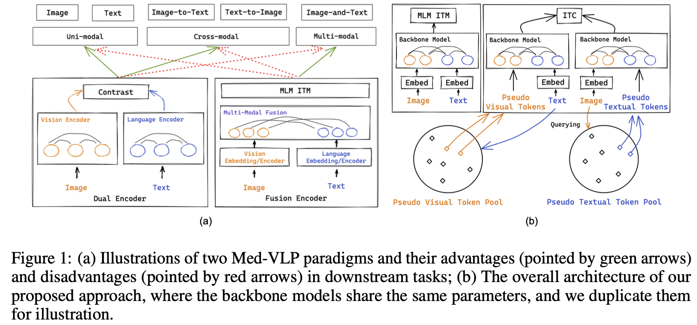
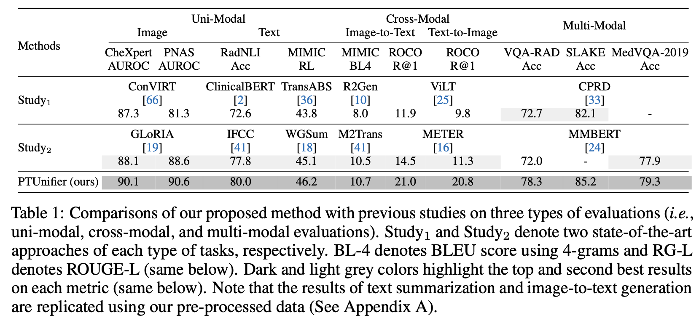
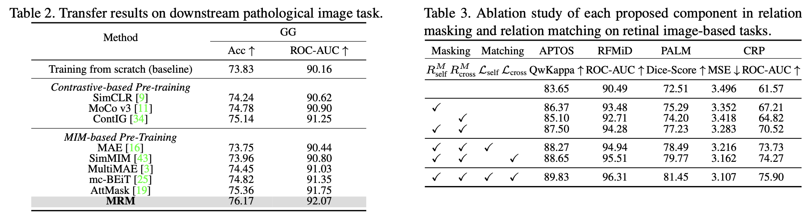

# ICCV-2023 医学大模型

Author: <a href="https://yusijin02.github.io/">Sijin Yu</a>

## News
- 2023年10月11日

  [1] <a href='https://arxiv.org/abs/2301.00785'>CLIP-Driven Universal Model for Organ Segmentation and Tumor Detection</a>

  [2] <a href='https://arxiv.org/abs/2302.08958'>Towards Unifying Medical Vision-and-Language Pre-training via Soft Prompts</a> 

- 2023年10月13日

  [3] <a href='https://openaccess.thecvf.com/content/ICCV2023/papers/Yang_MRM_Masked_Relation_Modeling_for_Medical_Image_Pre-Training_with_Genetics_ICCV_2023_paper.pdf'>MRM: Masked Relation Modeling for Medical Image Pre-Training with Genetics</a>

[TOC]

## 1.【器官分割】【肿瘤检测】CLIP-Driven Universal Model for Organ Segmentation and Tumor Detection

### 1.0 文章信息

> **标题**: CLIP-Driven Universal Model for Organ Segmentation and Tumor Detection
>
> **arXiv URL**: https://arxiv.org/abs/2301.00785
>
> **代码**: https://github.com/ljwztc/CLIP-Driven-Universal-Model
>
> **会议/期刊**: ICCV-2023

### 1.1 摘要

- 越来越多的公开数据集对自动**器官分割**和**肿瘤预测**产生了显著影响.
- 但是, 因为每个数据集的规模小和部分标注问题, 以及对每种肿瘤有限的调查, 导致模型往往**只能分割特定的器官/肿瘤, 而忽略图像的语义和解刨学结构**, 它们不能被拓展到新的领域. [⚠️注: 这里说的“部分标注问题”指的是, 数据集中一部分数据有标签, 而另一部分无标签.]
- 为了解决这一问题, 我们提出了 **CLIP-Driven Universal Model (CLIP 驱动的通用模型)**, 它将 CLIP 里的词嵌入学习合并到分割模型.
- 这一基于 CLIP 的标签编码**捕获了解剖学关系**, 使**模型能够学习结构化的特征嵌入**, 可以分割 25 种不同的器官和 6 种不同的肿瘤.
- 我们提出的模型从 14 个数据集合并后的数据训练而来. 一共使用了 3410 张 CT 扫描作为训练, 并且在此外的 3 个数据集里取了另外 6162 张 CT 扫描用作评估.
- 我们在 MSD 公开排行榜上排名第一, 并且在 BTCV 上达到了 SOTA.
- 此外, 这一通用模型比起特定数据集模型有更高效的**计算性能** (快了 6 倍), 在不同的 CT 扫描站点间有更好的**泛化能力**, 并且在新任务上表现出了更强大的**迁移学习能力**.

### 1.2 模型

模型分为 **text branch (文本分支)**、 **vision branch (视觉分支)**, 并使用了 **masked back-propagation (掩码回传)**.

#### 1.2.1 问题定义

令一个数据点是 $(\textbf X_n,\textbf Y_n)$, 其中, 这一数据点属于 $k\in[1,K]$ 个类别. 我们要训练的模型为 $\mathcal F(\cdot)$. 此前有两种多类别预测的解决办法:

1. 解 $\mathcal F_{\theta}(\textbf X_n)=\textbf P_n^k$, 其中, $\textbf P_n$ 是一个 one-hot 编码.
2. 解 $\mathcal F_{\theta}(\textbf X_n, \mathbf \omega_k)=\textbf P_n$, 其中, $\omega_k$ 是一个指明预测哪一类的 one-hot 编码.

#### 1.2.2 Text Branch

- 令 $\omega_k$ 为第 $k$ 类的 CLIP embedding.
- 令 $f$ 为全局图像特征.
- **text-based controller (基于文本的控制器)**: $\theta_k=\text{MLP}(\text{Concat}(\omega_k,f))$. 对于每一个类 $k$, 都如此计算.

#### 1.2.3 Vision Branch

- 令 $F$ 为 vision encoder 提取的图像特征. [⚠️注: $F$ 和上文 Text Branch 中提到的 $f$ 的关系为: $F$ 经过全局平均池化 (global average pooling) 后得到 $f$]

- **text-driven segmentor (基于文本的分割器)**: 对于每个要预测的类别 $k$, 使用三个 $1\times1\times1$ 的卷积核, 它们的参数分别为 $\theta_{k_1}, \theta_{k_2}, \theta_{k_3}$, 都由 Text Branch 中计算而来, 即 $\theta_k=\{\theta_{k_1}, \theta_{k_2}, \theta_{k_3}\}$.

  $P_k=\text{Sigmoid}(F*\theta_{k_1}*\theta_{k_2}*\theta_{k_3})$ 为对第 $k$ 类的分割预测. 其中, $P_k\in\mathbb R^{1\times D\times W\times H}$ 为这一类分割后的前景图. 

### 1.3 部分实验

下面是在 MSD 数据集上做分割的结果.

下面是综合计算性能和分割性能的比较.

下图是一些分类结果的可视化.

---

## 2. 【医疗视觉语言模型】【Prompting 工程】Towards Unifying Medical Vision-and-Language Pre-training via Soft Prompts

### 2.0 文章信息

> **标题**: Towards Unifying Medical Vision-and-Language Pre-training via Soft Prompts
>
> **arXiv URL**: https://arxiv.org/abs/2302.08958
>
> **代码**: https://github.com/zhjohnchan/PTUnifier
>
> **会议/期刊**: ICCV-2023

### 2.1 摘要

- **医学视觉语言预训练 (Medical vision-and-language pre-training, Med-VLP)** 在许多下游医学任务中展现出其发展前景, 因为它对医学图像和文本的通用表示提取的适用性.
- 实际上, 这种模型存在两种主要的类型: **融合编码 (fusion-encoder) 类型**和**双塔编码 (dual-encoder) 类型**. 这取决于模型是否使用了一个复杂的融合模块.
- 前者 (融合编码) 在多模态任务上表现更强, 因为它有**充足的模态间互动**; 而后者 (双塔编码) 在单模态和跨模态任务上更强, 因为它有**强大的单模态编码能力**.
- 为了结合两者的优点, 我们提出了一个有效但直接的模型, **PTUnifier** 以合并两种类型.
- 我们首先引入**视觉和文本提示 (visual and textual prompts)** 以**统一输入格式**, 它可以作为最具代表性的图像/文本特征库.
- 通过如此做, 一个单一的模型可以作为**适应不同输入格式的、处理多种任务的基础模型** (例如, 仅图像, 仅文本, 图像-文本).
- 此外, 我们构造了一个**提示池 (prompt pool)** (而不是静态的池) 以提高多样性和可扩展性.
- 实验结果说明我们的方法在一系列的任务中取得了 SOTA 结果, 包括**跨单模态任务** (spanning uni-modal tasks) (例如图像/文本分类、文本摘要), **交叉模态任务** (cross-modal tasks) (例如图像到文本生成、图像-文本/文本-图像检索), 和**多模态任务** (multi-modal tasks) (例如视觉语言问答). 这些均证明了我们方法的有效性.
- 请注意, 这种提示的方法**与大多数现有的 Med-VLP 模型正交**, 这意味着这可能是对这些方法有益的、互补的拓展.

### 2.2 模型

下图 (a) 对比了双塔模型 (左) 和融合模型 (右) 在不同任务上的优势 (绿) 和劣势 (红). 图 (b) 是本文模型的概览, 其中 Backbone Model 共享权重.

#### 2.2.1 问题定义

- 给定一个医学图像的 embedding $\textbf X^v\in\mathbb R^{D_v\times N_v}$, 和与它相对应的文本 embedding $\textbf X^l\in\mathbb R^{D_l\times N_l}$, 令 $\textbf X$ 为 backbone model 的输入.

  - 当只有图像输入时, $\textbf X=(\textbf X^v, \textbf{PT}^l)$
  - 当只有文本输入时, $\textbf X=(\textbf{PT}^v,\textbf X^l)$
  - 当同时有图像和文本输入时, $\textbf X=(\textbf X^v,\textbf X^l)$

  其中, $\textbf{PT}^v\in\mathbb R^{D_v\times k}$ 和 $\textbf{PT}^l\in\mathbb R^{D_l\times k}$ 分别是视觉和文本提示.

  [⚠️注: 这里暂时只是形式上这样记, 此时只需要搞清楚: $\textbf X$ 是已经统一格式的、包含图像和文本的、允许模态缺失的 backbone model 的输入. 至于更细节的内容请看下文.]

- 令 $S$ 为 pretext tasks 的数目

- 令 $\mathcal L_s$ 为任务 $s$ 的损失函数

- 令 $Y_s$ 为任务 $s$ 的 ground-truth 标签

- 令 $\mathcal H_{\theta_s}$ 为任务 $s$ 的预测头, 其参数为 $\theta_s$

- 令 $\mathcal M_{\theta}$ 为 backbone model, 其参数为 $\theta$

则, 学习的过程可以被形式化表示为:
$$
\theta^*,\theta_1^*,\cdots,\theta_S^*=\arg_{\theta,\theta_1,\cdots,\theta_S}\min\sum_{s=1}^S\mathcal L_s(Y_s,\mathcal H_{\theta_s}(\mathcal M_{\theta}(\textbf X)))
$$

#### 2.2.2 Prompt Pool

- 令 $D_v$ 是视觉 embedding 维度, $D_l$ 是文本 embedding 维度.

- 令 $N_v$ 是视觉 prompt pool 的大小, $N_l$ 是文本 prompt pool 的大小.

- 定义 **visual prompt pool** 为 $\textbf V\in\mathbb R^{D_v\times N_v}$, **textual prompt pool** 为 $\textbf T\in\mathbb R^{D_l\times N_l}$.

- 当模态缺失时, 也即只有单一模态输入时, 我们通过**池化操作** (平均池化/最大池化) 得到一个已有模态的**查询向量 (query vector)**.

  - 当仅视觉输入时, 即文本缺失:
    $$
    \textbf q^v=\text{pooling}(\textbf X^v)
    $$

    $$
    \textbf{PT}^l=\text{top-}k_{\omega\in\textbf V}[\omega^T\textbf q^v]
    $$

  - 当仅文本输入时, 即视觉缺失:
    $$
    \textbf q^l=\text{pooling}(\textbf X^l)
    $$

    $$
    \textbf{PT}^v=\text{top-}k_{\omega\in\textbf T}[\omega^T\textbf q^l]
    $$

  其中, $\omega$ 是 prompt pool 里的一个 embeding 向量, 我们在 prompt pool 中选取最相关的 $k$ 个 prompt 作为缺失模态的输入 embedding 序列.

#### 2.2.3 视觉和文本的 embedding

- **Visual Embedding**:

  对于一个图像输入 $I$, 将其的打为 $N_v$ 个 patch. 在此之前有个 CLS token, 并且需要加上位置编码. 即:
  $$
  \textbf X^v=\left[
  x_{\text{[CLS]}}^v;x_1^v;x_2^v;\cdots;x_{N_v}^v
  \right]
  +\textbf E_{pos}^v
  $$

- **Textual Embedding**:

  在图像的基础上, 增加一个句结尾 SEP token.
  $$
  \textbf X^l=\left[
  x_{\text{[CLS]}}^l;x_1^l;x_2^l;\cdots;x_{N_l}^l;x_{\text{[SEP]}}^l
  \right]
  +\textbf E_{pos}^l
  $$

#### 2.2.4 多训练目标

模型同时在下面任务下学习:

- (MLM) Masked Language Modeling

- (ITM) Image-Text Matching
- (ITC) Image-Text Contrast

### 3. 部分实验

下图为与其它模型的对比.

下图为三个训练任务组合的消融实验.

---

## 3. 【多模态】MRM: Masked Relation Modeling for Medical Image Pre-Training with Genetics

### 3.0 文章信息

> **标题**:
>
> **pdf URL**: https://openaccess.thecvf.com/content/ICCV2023/papers/Yang_MRM_Masked_Relation_Modeling_for_Medical_Image_Pre-Training_with_Genetics_ICCV_2023_paper.pdf
>
> **代码**: https://github.com/CityU-AIM-Group/MRM
>
> **会议/期刊** ICCV-2023

### 3.1 摘要

- 在自动多模态医疗诊断的现代深度学习技术依赖于大量的专业标注, 这是费时费力的.
- 最近, 基于**图像掩码模型 (Masked Image Modeling, MIM)** 的预训练方法在**从无标签的数据中学习有意义的表达**和**迁移到下游任务**方面取得了重大进展.
- 但是, 这些方法只关注于**自然图像**, 而**忽略了医学数据中的特性**, 导致在医疗问诊的下游任务上**泛化性能表现不佳**.
- 在本文中, 我们旨在**利用遗传学**来促进图像预训练, 并提出一个**关系掩码模型 (Masked Relation Modeling, MRM)** 框架.
- 我们没有像以前的 MIM 方法一样, 直接掩盖输入数据, **这将导致疾病相关语义的缺失**. 取而代之, 我们设计了关系掩码, 在**自模态**和**跨模态**层面, **掩盖 token 级别的特征关系**, 这**在输入中保存了完整的语义信息**, 并**允许模型学习更丰富的疾病相关信息**.
- 除此以外, 为增强语义关系建模, 我们提出**关系匹配 (relation matching)** 以**对齐完整的和掩盖的特征在样本层面的关系**.
- 关系匹配通过**鼓励特征空间中的全局约束**, 来利用**样本间关系**, 为特征表示提供足够多的**语义关系**.
- 大量的实验证明, 我们提出的框架简单但强大, 在各种下游诊断任务中达到了 SOTA 迁移性能.

### 3.2 模型

[⚠️注: 这篇文章把**医学图像 (image)** 和**遗传信息 (genome)** 当作两个输入模态, 但是处理方法完全可以类比到传统的多模态, 只需要把 genome 当作 text]

下图: 不同的掩码策略的对比.

- (a) 自然图像中的 MIM.
- (b) 在医学数据中的 MIM, 容易把发病点 mask, 导致无法辨认疾病.
- (c) 本文的 MRM, 将 relation mask 掉, 并且在样本层面匹配.

下图: 模型框架总览.

#### 3.2.1 MRM (Masked Relation Modeling)

- **自模态 relation masking**

  - 对于第 $i$ 个 relation masking block, 输入的 image token 是 $z_I^0$.

  - 使用三个独立的 MLP 分别计算 $z_I^0$ 的 key $K_I^S$, query $Q_I^S$, 和 value $V_I^S$.

  - 计算 self-modality relation 
    $$
    R_{\text{self}}=\text{Softmax}\left(
    \frac{1}{\sqrt d}Q_I^S\cdot(K_I^S)^T
    \right)
    $$

  - 对于矩阵 $R_{\text{self}}$ 里的每一行, 以 masking ratio $\tau_I$ 对里面值最大的元素 mask, 即:

    - $R_{\text{self}}^M[p,q]=R_{\text{self}}^M[p,q]$ if $R_{\text{self}}^M[p,q]<r_{\text{self}}^p$
    - $R_{\text{self}}^M[p,q]=0$ else

    其中, $r_{\text{self}}^p$ 是指矩阵 $R_{\text{self}}$ 的第 $p$ 行的 top-$\tau_I$ 个元素的强度.

  - masked 的关系矩阵 $R_{\text{self}}$ 用于和 value 计算 attention 后的 token.
    $$
    z_I^S=R_{\text{self}}^MV_I^S
    $$

  - 对于 genome 模态, 同理得到 $z_G^S$.

- 

- **互模态 relation masking**

  - 通过上述过程, 得到 $z_I^S$ 和 $z_G^S$.

  - 计算 cross-modality relation
    $$
    R_{\text{cross}}=\text{Softmax}\left(
    \frac{1}{\sqrt d}Q_I^C\cdot(K_G^C)^T
    \right)
    $$
    这里的 $Q_I^C$ 和 $K^C_G$ 分别由 $z_I^S$ 和 $z_G^S$ 计算而来. (或者反过来)

  - 同上理, 对 $R_{\text{cross}}$ mask 后得到 $R_{\text{cross}}^M$.

  - 计算 $z_I^C=R_{\text{cross}}^MV_G^C$

#### 3.2.2 relation masking 的重建

- 将 $z_I$ 和 $z_I^C$ 传入 Transformer Blcok 中, 分别得到 $z_I$ 和 $z_{I,M}$.

- 将 $z_G$ 和 $z_G^C$ 传入 SNN Layer 中, 分别得到 $z_G$ 和 $z_{G,M}$.

- 将它们 concat 起来, 令 $z_I^F=\text{concat}(z_{I,M};z_G)$, $z_G^F=\text{concat}(z_{G,M};z_I)$.

- 令 $h_I(\cdot)$ 和 $h_G(\cdot)$ 分别表示 image 和 genome 的重建 decoder.

- 重建 image 和 genome 的 loss 为:
  $$
  \mathcal L_{\text{recon}}=||h_I(z_I^F)-x_I||^2_2+||h_G(z_G^F)-x_G||^2_2
  $$

#### 3.2.3 关系匹配 (Ralation Matching)

- **自模态的关系匹配**

  - 考虑一个批量大小为 $B$ 的多模态输入数据对 $\{x_I^i,x_G^i\}_{i=1}^B$, 特征表达为 $\{z_I^i,z_G^i\}_{i=1}^B$, masking relation 的特征表达为 $\{z_{I,M}^i,z_{G,M}^i\}_{i=1}^B$.
  - 计算样本之间的特征表达相似性
    - $R_{II}^{i,j}=\text{sim}(z_I^i;z_I^j)$
    - $R_{GG}^{i,j}=\text{sim}(z_G^i;z_G^j)$

  - 计算样本之间的 masked feature 的特征表达相似性

    - $R_{II,M}^{i,j}=\text{sim}(z_{I,M}^i;z_{I,M}^j)$

    - $R_{GG,M}^{i,j}=\text{sim}(z_{G,M}^i;z_{G,M}^j)$

  - Relation Matching 的 loss 为
    $$
    \mathcal L_{\text{self}}=\frac{1}{2B^2}\sum_{i=1}^B\sum_{j=1}^B\left(
    ||R_{II}^{i,j}-R_{II,M}^{i,j}||^2_2+
    ||R_{GG}^{i,j}-R_{GG,M}^{i,j}||^2_2
    \right)
    $$

- **互模态的关系匹配**

  - $R_{IG}^{i,j}=\text{sim}(z_I^i;z_G^i)$

  - $R_{IG,M}^{i,j}=\text{sim}(z_{I,M}^i;z_{G,M}^j)$

  - Relation Matching 的 loss 为
    $$
    \mathcal L_{\text{cross}}=\frac{1}{B^2}\sum_{i=1}^B\sum_{j=1}^B||R_{IG}^{i,j}-R_{IG,M}^{i,j}||^2_2
    $$

#### 3.2.4 优化目标

使用超参数 $\lambda$ 来平衡**特征重构**和**关系匹配**, 总的 loss 为
$$
\mathcal L=\mathcal L_{\text{recon}}+\lambda(\mathcal L_{\text{self}}+\mathcal L_{\text{cross}})
$$

### 3.3 部分实验

在四种基于视网膜图像的下游任务训练集中与 SOTA 的对比

在视网膜图像下游任务中的迁移学习能力; 以及关于 self-masking, cross-masking, self-matching, cross-matching 的消融实验.

